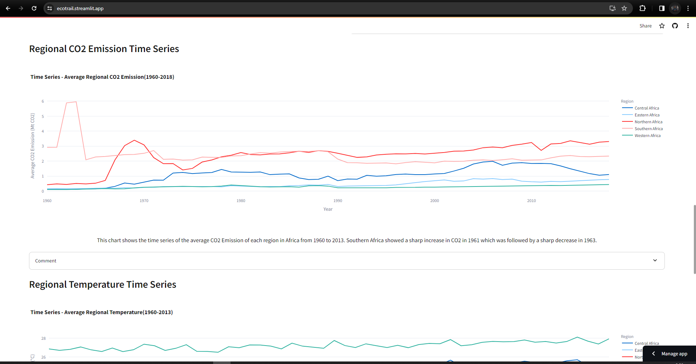

# Ecotrail

A software application that provides comprehensive insights into historical climate data for individual African countries.

## Getting Started

1. Clone this repository to your local machine:

   ```bash
   git clone https://github.com/SundayOlubode/ecotrail.git
   ```

2. Create Virtual Environment:

   ```bash
   python -m venv venv
   ```

3. Activate Virtual Environment:
   - Windows:
   ```bash
   venv\Scripts\activate
   ```
   Git Bash:
   ```bash
   source venv/Script/activate
   ```
   - Unix or MacOS:
   ```bash
   source venv/bin/activate
   ```
4. Install dependencies:
   ```bash
   pip install -r requirements.txt
   ```
5. Run App:
   ```bash
   streamlit run app.py
   ```

## Screenshot



# Author

- [Samuel Olubode](www.github.com/SundayOlubode)
